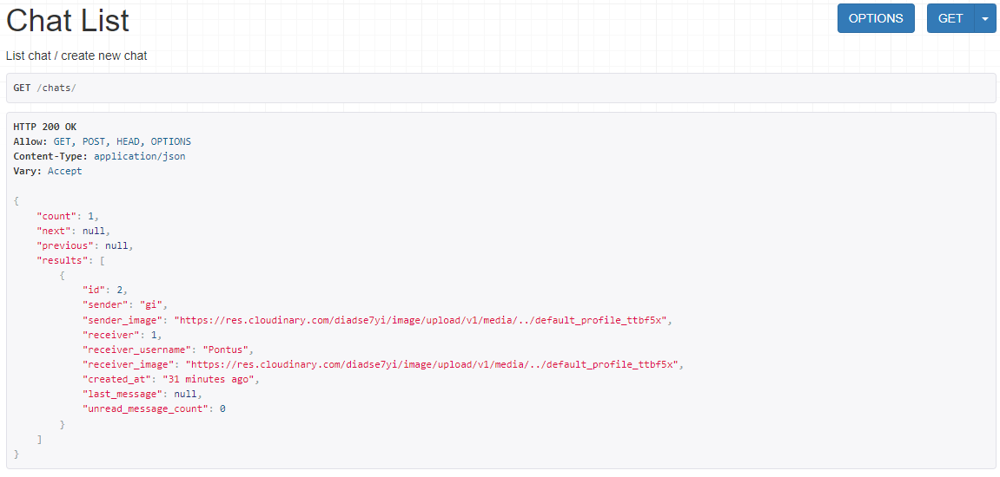
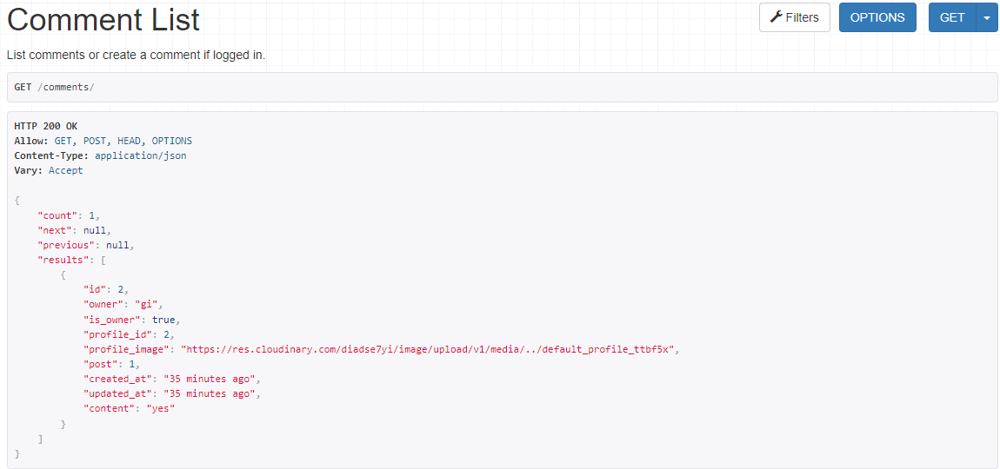
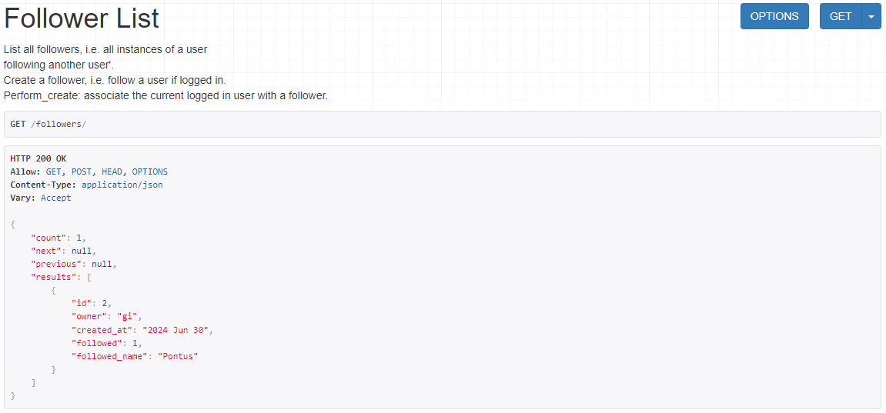
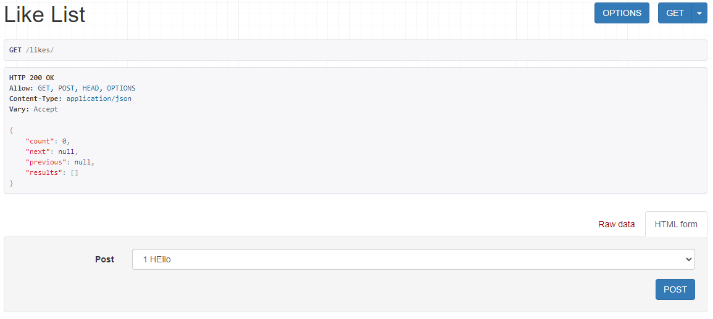
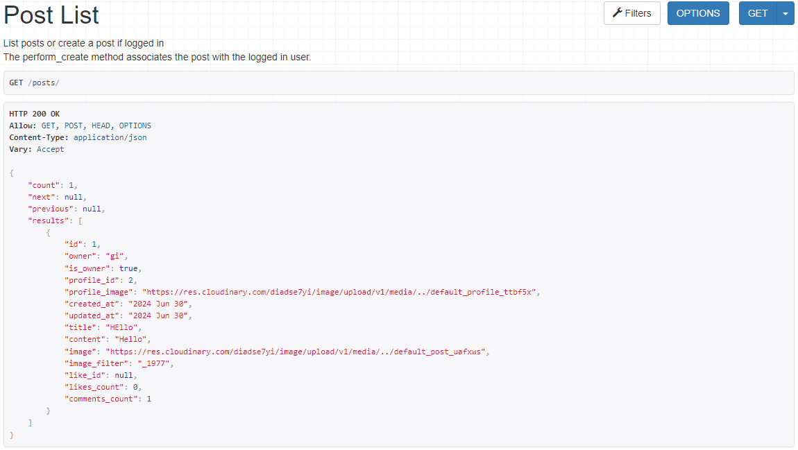
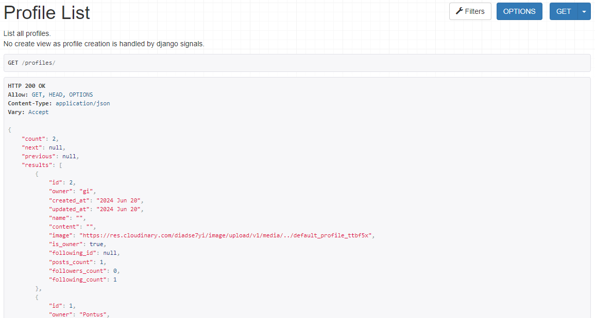
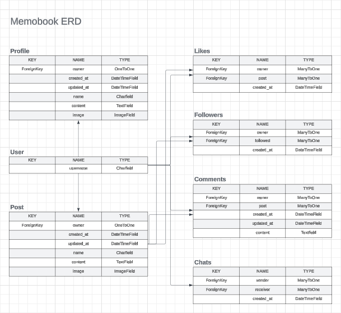
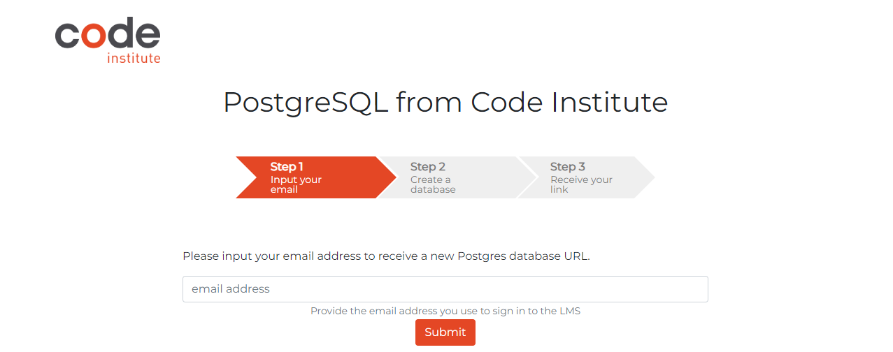

# Memobook DRFAPI

Memobook is a platform for people to stay connected. It provides features like sharing posts, chatting and commenting on posts. Memobook_drfapi was created along side with my study material from Code Institute and the walkthrough moments. 

The backend of Memobook is powered by Django REST Framework and the API is the bridge between the frontend and the database. Handling a variety of functions, including authentications etc. 

Links to the frontend: 

Github repository: (https://github.com/GigiLi89/memobook)

Final deployed site: (https://memobook-af0ef88c7472.herokuapp.com/)

---

## Features/tables

The id is unique and acts like the identifier for each entry. 

### Chats

### Comments

### Followers

### Likes

### Posts

### Profiles

## Future Features

- Expanding search capabilities
- Rate posts
- Upload more than one image

---

## ERD

---

## Security Features
This project is secured by using Django REST permissions and React redirect hook which are protecting the views to write and edit posts and comments. As a user, they can not bypass and change urls to make changes to the site content. They cant access the admin panel either. 

Secret key, Database url and cloudinary url are stored safely in env.py and config vars (Heroku). This will not show in Github repository. 

## Packages Used and more information

- cloudinary: Cloudbased media management for storing, manipulating and delivering media to the Django project. 
- django-cloudinary-storage: Extends Djangos default file storage system to work with Cloudinary. Gives easy storage and access to files from Cloudinary.
- dj-database-url: Enables the DATABASE_URL enviromental variable in the settings file by simplifying the connection to PostgreSQL (CI Database) by parsing the URL and auto-configuring the database settings accordingly.
- django-allauth: Used for account registration, management and authentication with templates, views and forms to handle user auth.
- dj-rest-auth: A Django REST Framework extension for API to handle authentication in DRF projects with endpoints for registration, signin, signout, password, reset and other relatable functions.
- django-filter: Provides a flexible syntax for specifying filters and tegrates seamlessly with DRF.
- djangorestframework-simplejwt: Is a JSON Web Token (JWT) which is an authentication backend for Django REST Framework. It's an easy way to implement roken based authentication in your DRF giving you a secure and statless API authentication.
- pyJWT: JSON Web Token implementation in Python
- django-cors-headers: Adds CORS headers to HTTP responses which enables cross-origin requests from clients JavaSScript app to interact with the Django backend. 
- gunicorn: Used for deploying Django applications and allows it to handle multiple concurrent requests efficiently.
- pillow: Fork of Python Image Library, is a library for image processing in Python with editing functions. 
- psycopg2:A Python adapter for PostgreSQL databases. Allows Django to connect and interact with PostgreSQL databases and making it able to store and retireve data effienctly.
- react-toastify: enables notifications to be shown for user, example: if message was edited/deleted successfully. 

---

## Languages and Frameworks libraries

- Django
- Python
- Django REST Frameworks

---

## Credits and resources

- Lucidchart to make the ERD
- Gitpod to build/edit the code for this project
- Git used as version control
- GitHub, host for repository and management of git projects

- Django documentation: https://docs.djangoproject.com/en/3.2/
- Django REST Framework: https://www.django-rest-framework.org/
- DRF Tutorial: https://www.youtube.com/watch?v=t-uAgI-AUxc
- Python documentation: https://docs.python.org/3/
- Python Turorial: https://www.youtube.com/watch?v=_uQrJ0TkZlc
- DRF chat tutorial: https://medium.com/@Evenword/how-to-create-a-chat-bot-using-django-drf-579a7f0cff07 + https://www.youtube.com/watch?v=Rwa0UpMt1DA + https://www.youtube.com/watch?v=MPnNdpzJHoQ

### Code
- Code Institute DRF Tutorial Project, used through as a basis for the creation of this API
CREDIT: Code Institute DRF-API Tutuorial Project
URL: https://github.com/Code-Institute-Solutions/drf-api

---

# Deployment

Make sure you have your requirements.txt file saved:
In the terminal, write command: pip3 freeze > requirements.txt

requirements.txt is now updated so don't forget to push it to Github. 
Also, don't forget your Procfile, the Procfile is needed for deploying your project to Heroku. This is to specify the commands that are run by your application's dynos. It basically tells the platform how to start different parts of your application. 

## Forking GitHub Repository
1) Click on the projects repository on GitHub
2) In the upper right corner, in the menu, click on the Fork button
3) You should now have a copy of the repository in you own GitHub account

## Making a local clone
1) Click on the projects repository on Github
2) Click on the Code button
3) Choose HTTPS, SSH or GitHub CLI and click Copy button
4) Type git clone and paste the URL that you've copied in step 3
5) Press Enter to create a local clone

## Deploying to Heroku
(Make sure everything is pushed to GitHub. If changes are made after deployment, don't forget to redeploy it on Heroku)

### Create database with CI
1) Go to the "PostgreSQL from Code Institute" site provided by Code Insitute.

2) Follow the steps and copy the URL given to you after the steps has been fullfilled. 

### Create Heroku App

Settings tab:

1) Go to Heroku and create an account + sign in
2) Create a new app and follow the steps (the name you choose has to be unique)
3) In the Settings tab, click on Reveal Config Vars and fill out the following: 
- Key: ALLOWED HOST (value: the URL of your deployed project to Heroku, ends with .herokuapp.com)
- Key: CLIENT_ORIGIN (value: the URL of your deplyed frontend project to Heroku)
- Key: CLIENT_ORIGIN_DEV (value: the URL to your workspace URL of the project)
- Key: CLOUDINARY_URL (the API enviroment issued to you from your cloudinary account)
- Key: DATABASE_URL (the URL recieved from Code Institute, see instructions above)
- Key: SECRET_KEY (generated by a secret key generator)

Deploy tab: 

Connect Heroku account to GitHub repository:
1) Click the Deploy tab at the top of the page
2) Enter GitHub repository name and click the Search button
3) Choose the correct repository and click the Connect button
4) At the bottom of the page on Manual Deploy, click Deploy Branch button
5) You can follow the building log and when the log says that the build is successful you can click on View at the bottom of the page or Open app at the top of the page to see the deployed site. 

---

# Testing

Please find the TESTING.MD document in a seperate document here: [TESTING.md](TESTING.md)