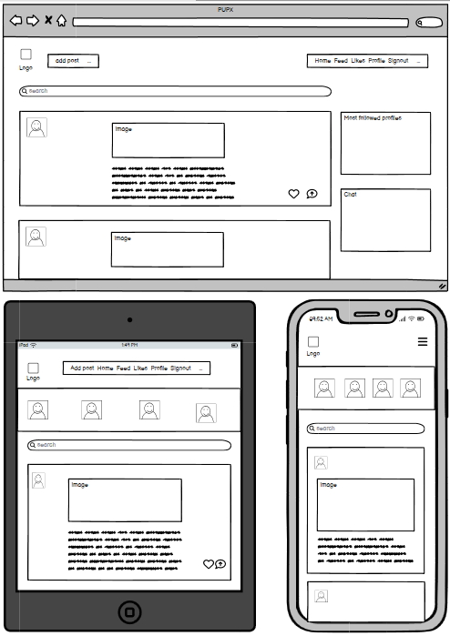

# About / Introduction

Link to the deployed project:

Memobook, or Memo for short, is a platform for friends and family to connect and share posts with stories and images with eachother. Users are able to interact with posts/eachother by likes, comments and even chats. 

The idea for this project came to me as I was buildning a project along side the learning materials from Code Institute, but with a twist and the idea of expanding the idea with something more. Memobooks concept was developed as a interactive place for people to connect and as the in the name, shar memos - Memories!

The project is built in two parts, a backend and a frontend, keeping them seperate for a better overview. This part is the backend.

Link to the frontend repository: 

---

# Wireframes (created in Balsamiq)

Memobooks wireframes, a rough sketch of the project with the focus of the site being responsive as the priority as well as choosing colours that will meet accessability criterias. 

The difference between the desktop version compared to the tablet and mobile version is of course the layout but also the column to the right on the desktop page disapears on tablet and mobile mode. This will make it more user friendly and eliminate "not necessary" objects to optimize the space on a smaller display.

---

# Process of building the workspace

After creating a new repository with the new CI template I opened the workspace in VS code through Gitpod. Most of the project was not made with Gitpod Enterprise since I had major issues moving there. After talking to both Student Care and 3 different tutors I was told to use the old Gitpod and wait for more information until the issues were fixed. 

I installed Django and started my DRF API project. I also started setting up Cloudinary, PostgreSQL and Heroku for:
- Cloudinary: To store images
- PostgreSQL: Database
- Heroku: For deployment

First I created the DRF API and the necessary apps for the project: Profile, Post, Comment, Like, Followers and Chat. Models using the ERD's that were necessary to handle and store user data for the project in the database. Using generic views and serializers to create all of them.

